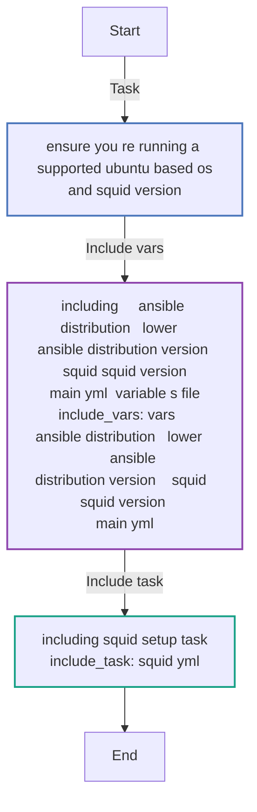

<!-- DOCSIBLE START -->

# 📃 Role overview

## ansible-role-squid

**Description** 

An Ansible Role that installs and configures an http/https Squid proxy.


⚠️ This Ansible Role currently supports only **Ubuntu 20.04 OS**.

**How to execute it?**

**1-** Create the following files, customizing the contents of the inventory and vars.yml files according to your requirements:
```
.
├── ansible.cfg
├── inventory
├── main.yml
├── requirements.yml
```

`ansible.cfg`:
```
➜ cat ansible.cfg
[defaults]
host_key_checking = False
inventory = inventory

[privilege_escalation]
become=True
become_method=sudo
become_user=root
become_ask_pass=False

[ssh_connection]
ssh_args = -o HostKeyAlgorithms=+ssh-rsa -o PubkeyAcceptedKeyTypes=+ssh-rsa
```

`inventory`:
```
➜ cat inventory
[squid]
123.123.123.123 ansible_ssh_port=33333 ansible_ssh_user=ubuntu ansible_ssh_private_key_file=/Users/myuser/.ssh/id_rsa_myuser
```

`requirements.yml`:
```
➜ cat requirements.yml
---
roles:
  - name: lesposito87.ansible-role-squid
    src: https://github.com/lesposito87/ansible-role-squid.git
    version: main
```

`main.yml`:
```
➜ cat main.yml
---
- hosts: squid
  become: true
  gather_facts: True
  vars_files:
    - vars.yml

  tasks:
    - include_role:
        name: lesposito87.ansible-role-squid
```

**2-** Install the Ansible Role locally:
```
➜ ansible-galaxy install -r requirements.yml --force
```


**3-** Customize the default variables based on your needs.

For example, if you want to change the `domain_name` variable to match the dns domain in which your instance belongs to, create the directory `group_vars/squid`, the file `group_vars/squid/main.yml` and declare your variable within it:
```
➜ mkdir -p group_vars/squid

➜ echo 'domain_name: "myowndomain.com"' >> group_vars/squid/main.yml
```

**4-** Execute the Ansible Playbook:
```
➜ ansible-playbook main.yml
```

<br>

### Defaults

**These are static variables with lower priority**

#### File: defaults/main.yml

| Var          | Type         | Value       |Required    | Title       |
|--------------|--------------|-------------|-------------|-------------|
| [domain_name](defaults/main.yml#L6)   | str   | `mydomain.com` |    True  |  The DNS domain in which your Squid instance belongs to. This will be used to generate the Wildcard Self Signed certificates. If the hostname of your instance is `squid.myowndomain.com` then this variable has to be set as `myowndomain.com` |
| [squid_version](defaults/main.yml#L8)   | str   | `5` |    True  |  Squid version you want to install; it can be `4` or `5` |
| [squid_pin](defaults/main.yml#L10)   | bool   | `True` |    True  |  Choose if pin or not Squid pkgs version |
| [squid_http_port](defaults/main.yml#L12)   | str   | `3128` |    True  |  Squid http port |
| [squid_https_port](defaults/main.yml#L13)   | str   | `3129` |    True  |  Squid https port |
| [squid_additional_src_nets](defaults/main.yml#L15)   | list   | `[]` |    True  |  Additional Source subnets to allow communicating with our Squid instance: <pre>squid_additional_src_nets: <br>  - 192.168.32.100/32<br>  - 192.168.32.101/32</pre> |
| [squid_additional_ssl_ports](defaults/main.yml#L16)   | list   | `[]` |    True  |  Additional allowed destination TLS ports: <pre>squid_additional_ssl_ports:<br>  - 443<br>  - 6443</pre> |
| [squid_additional_safe_ports](defaults/main.yml#L17)   | list   | `[]` |    True  |  Additional allowed destination ports: <pre>squid_additional_safe_ports:<br>   - 8080<br>   - 8081</pre>|
| [squid_certs_dir](defaults/main.yml#L19)   | dict   | `{'path': '/etc/squid/certs', 'owner': 'root', 'group': 'root', 'mode': 'u=rwX,g=rX,o=rX'}` |    True  |  Path where to store the TLS Self signed certificates |
| [squid_certs_cert](defaults/main.yml#L25)   | str   | `squid-ca-cert.pem` |    True  |  TLS certificate file name |
| [squid_certs_key](defaults/main.yml#L26)   | str   | `squid-ca-key.pem` |    True  |  TLS key file name |
| [squid_certs_chain](defaults/main.yml#L27)   | str   | `squid-ca-cert-key.pem` |    True  | TLS chain file name |
| [squid_certs_local_path](defaults/main.yml#L28)   | str   | `/tmp/squid/squid-ca-cert.pem` |    True  |  Local directory where the resulting TLS certificates will be copied. |
| [full_reconfig](defaults/main.yml#L30)   | bool   | `False` |    True  |  Set this to `true` if you want to regenerate TLS certificates |

<br>

### Tasks


#### File: tasks/squid.yml

| Name | Module | Has Conditions |
| ---- | ------ | --------- |
| Ensure "python3-selinux" pkg is installed | package | False |
| Check if SELinux is installed | find | False |
| Configuring SELinux in permissive mode | ansible.posix.selinux | True |
| Ensure Firewalld/Iptables service are stopped | service | False |
| Adding Apt signing key | ansible.builtin.apt_key | False |
| Adding Squid Debian repository | ansible.builtin.apt_repository | False |
| Installing required packages | package | False |
| Gather packages facts | package_facts | False |
| UnPin Squid packages (apt) | dpkg_selections | True |
| Installing Squid packages | package | False |
| Pin Squid packages (apt) | dpkg_selections | True |
| Ensure Self Signed certificates directory exists | file | False |
| Retrieving Self Signed certificates | find | False |
| Generating and Copying Self Signed certificates | block | True |
| Ensure Squid service is stopped | service | False |
| Creating Self Signed certificates | shell | False |
| Ensure ownership of Self Signed certificates directory is correct | file | False |
| Verifying Squid config | block | False |
| Copying temporary Squid template | template | False |
| Squid template syntax check | command | False |
| Copying Squid template | template | False |
| Remove temporary Squid template | file | False |
| Enabling & Starting Squid Service | service | False |
| Copying locally the SSL certificate file to mount on the agent | ansible.builtin.fetch | False |
| Printing certificate location | debug | False |

#### File: tasks/main.yml

| Name | Module | Has Conditions |
| ---- | ------ | --------- |
| Ensure you're running a supported Ubuntu based OS and Squid version | assert | False |
| Including "{{ ansible_distribution ¦ lower }}_{{ ansible_distribution_version }}/squid_{{ squid_version }}/main.yml" variable's file | include_vars | False |
| Including Squid setup task | include_tasks | False |

<br>

## Task Flow Graphs

### Graph for squid.yml

```mermaid
flowchart TD
Start
classDef block stroke:#3498db,stroke-width:2px;
classDef task stroke:#4b76bb,stroke-width:2px;
classDef includeTasks stroke:#16a085,stroke-width:2px;
classDef importTasks stroke:#34495e,stroke-width:2px;
classDef includeRole stroke:#2980b9,stroke-width:2px;
classDef importRole stroke:#699ba7,stroke-width:2px;
classDef includeVars stroke:#8e44ad,stroke-width:2px;
classDef rescue stroke:#665352,stroke-width:2px;

  Start-->|Task| Ensure__python3_selinux__pkg_is_installed0[ensure  python3 selinux  pkg is installed]:::task
  Ensure__python3_selinux__pkg_is_installed0-->|Task| Check_if_SELinux_is_installed1[check if selinux is installed]:::task
  Check_if_SELinux_is_installed1-->|Task| Configuring_SELinux_in_permissive_mode2[configuring selinux in permissive mode<br>When: **selinux result files   length   0**]:::task
  Configuring_SELinux_in_permissive_mode2-->|Task| Ensure_Firewalld_Iptables_service_are_stopped3[ensure firewalld iptables service are stopped]:::task
  Ensure_Firewalld_Iptables_service_are_stopped3-->|Task| Adding_Apt_signing_key4[adding apt signing key]:::task
  Adding_Apt_signing_key4-->|Task| Adding_Squid_Debian_repository5[adding squid debian repository]:::task
  Adding_Squid_Debian_repository5-->|Task| Installing_required_packages6[installing required packages]:::task
  Installing_required_packages6-->|Task| Gather_packages_facts7[gather packages facts]:::task
  Gather_packages_facts7-->|Task| UnPin_Squid_packages__apt_8[unpin squid packages  apt <br>When: **ansible pkg mgr     apt   and  squid pin bool   <br>true  and    squid common  in ansible facts<br>packages  or   squid openssl  in ansible facts<br>packages  or   squidclient  in ansible facts<br>packages**]:::task
  UnPin_Squid_packages__apt_8-->|Task| Installing_Squid_packages9[installing squid packages]:::task
  Installing_Squid_packages9-->|Task| Pin_Squid_packages__apt_10[pin squid packages  apt <br>When: **ansible pkg mgr     apt   and  squid pin**]:::task
  Pin_Squid_packages__apt_10-->|Task| Ensure_Self_Signed_certificates_directory_exists11[ensure self signed certificates directory exists]:::task
  Ensure_Self_Signed_certificates_directory_exists11-->|Task| Retrieving_Self_Signed_certificates12[retrieving self signed certificates]:::task
  Retrieving_Self_Signed_certificates12-->|Block Start| Generating_and_Copying_Self_Signed_certificates13_block_start_0[[generating and copying self signed certificates<br>When: **certs result files   length    0  or  full<br>reconfig   bool**]]:::block
  Generating_and_Copying_Self_Signed_certificates13_block_start_0-->|Task| Ensure_Squid_service_is_stopped0[ensure squid service is stopped]:::task
  Ensure_Squid_service_is_stopped0-->|Task| Creating_Self_Signed_certificates1[creating self signed certificates]:::task
  Creating_Self_Signed_certificates1-->|Task| Ensure_ownership_of_Self_Signed_certificates_directory_is_correct2[ensure ownership of self signed certificates<br>directory is correct]:::task
  Ensure_ownership_of_Self_Signed_certificates_directory_is_correct2-.->|End of Block| Generating_and_Copying_Self_Signed_certificates13_block_start_0
  Ensure_ownership_of_Self_Signed_certificates_directory_is_correct2-->|Block Start| Verifying_Squid_config14_block_start_0[[verifying squid config]]:::block
  Verifying_Squid_config14_block_start_0-->|Task| Copying_temporary_Squid_template0[copying temporary squid template]:::task
  Copying_temporary_Squid_template0-->|Task| Squid_template_syntax_check1[squid template syntax check]:::task
  Squid_template_syntax_check1-->|Task| Copying_Squid_template2[copying squid template]:::task
  Copying_Squid_template2-->|Task| Remove_temporary_Squid_template3[remove temporary squid template]:::task
  Remove_temporary_Squid_template3-.->|End of Block| Verifying_Squid_config14_block_start_0
  Remove_temporary_Squid_template3-->|Rescue Start| Verifying_Squid_config14_rescue_start_0[verifying squid config]:::rescue
  Verifying_Squid_config14_rescue_start_0-->|Task| Remove_temporary_Squid_template0[remove temporary squid template]:::task
  Remove_temporary_Squid_template0-->|Task| Failing_play1[failing play]:::task
  Failing_play1-.->|End of Rescue Block| Verifying_Squid_config14_block_start_0
  Failing_play1-->|Task| Enabling___Starting_Squid_Service15[enabling   starting squid service]:::task
  Enabling___Starting_Squid_Service15-->|Task| Copying_locally_the_SSL_certificate_file_to_mount_on_the_agent16[copying locally the ssl certificate file to mount<br>on the agent]:::task
  Copying_locally_the_SSL_certificate_file_to_mount_on_the_agent16-->|Task| Printing_certificate_location17[printing certificate location]:::task
  Printing_certificate_location17-->End
```




### Graph for main.yml



<br>

## Author Information
https://www.linkedin.com/in/lucaesposito87/

#### License

MIT

#### Minimum Ansible Version

2.7

#### Platforms

- **Ubuntu**: [20.04]

<!-- DOCSIBLE END -->